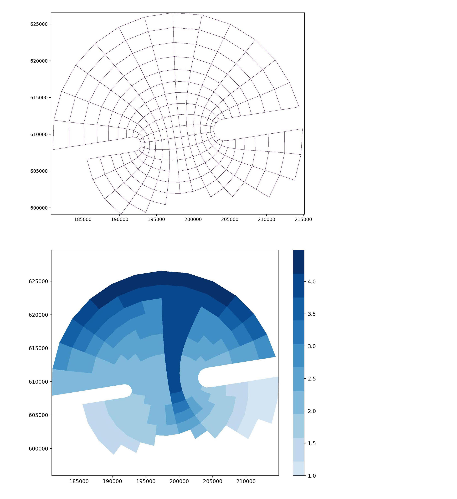

# Delft3D-Toolbox

Python package to work with Delft3D-FLOW model.

## Feature

- Run Delft3D FLOW model in parallel (require compiled Delft3D source code).
- Read, modify and write Delft3D time-series files including boundary file(`.bct`)(`.bcc`) and discharge file (`.dis`).
- Read, modify and write Delft3D model file (`.mdf`)
- Read, modify, visualize and write Delft3D grid file(`.grd`) and depth file (`.dep`).




## Installation

1. Clone or download the repository.

2. To directly import this module, add the 'delft3d' folder to one of  following directories:
    - Your project directories.

    - The 'site-packages' folder of Python installation. When using Anaconda, the most likely path is C:/users/[username]/Anaconda3/Lib/site-packages.

    - User defined directory. Create a (`.pth`) file containing the path of the user defined directory. Add this (`.pth`) file to the 'site-packages' folder. Here is an example of (`.pth`) file:

            D:/mymodule

3. Download the following dependencies using pip or conda.

    - pyproj
    - matplotlib
    - numpy
    - pandas

## Usage

Here is some examples of using this package. See more detail and examples in the docstring.

1. Run Delft3D Flow simulation
   ``` python
   import delft3d
   # supply the path of compiled Delft3D source code to create simulation runner
   sim = delft3d.Simulation('C:/Users/Carlisle/Desktop/62422/src/bin/x64')
   sim.run('example/dflow1/f34.mdf')  # run single simulation
   sim.run('example/dflow1/f34.mdf', disp=False)  # no simulation progress
   sim.run('example/dflow1/f34.mdf', netcdf=True)  # save simulation result as netcdf
   # run multiple simulations one by one
   sim.run(['example/dflow1/f34.mdf', 'example/dflow2/f342.mdf'])
   # run multiple simulations in parallel with 2 workers
   sim.run(['example/dflow1/f34.mdf', 'example/dflow2/f342.mdf'], workers=2)
   # run multiple simulations in parallel with all cpu cores
   sim.run(['example/dflow1/f34.mdf', 'example/dflow2/f342.mdf'], workers=-1)
   ```

2. Time-Series files(`.bct, .bcc, .dis`)

   ```python
   import delft3d
   import pandas as pd

   # read files
   bct = delft3d.TimeSeriesFile('example/example1.bct')
   bcc = delft3d.TimeSeriesFile('example/example1.bcc')
   dis = delft3d.TimeSeriesFile('example/example1.dis')

   # show header and data of the first time-series
   print(bct.data[0].header['reference-time'])
   print(bct.data[0].header['location'])
   print(bct.data[0].time_series)

   # modify header and data of the first time-series
   flow_series_A = pd.read_csv('example/flow_series_A.csv', index_col=0)
   flow_series_A.index = pd.to_datetime(flow_series_A.index)
   flow_series_B = pd.read_csv('example/flow_series_B.csv', index_col=0)
   flow_series_B.index = pd.to_datetime(flow_series_B.index)
   bct.set_header(0, {'time-unit': 'hours', 'location': '(2,3)..(4,6)'})
   bct.set_time_series(0, '2020-03-31', flow_series_A, flow_series_B)

   # write to a file
   bct.to_file('edited_bct.bct')

   ```

3. Model file (`.mdf`)

   ```python
   import delft3d

   # read files
   mdf = delft3d.MdfFile('example/example1.mdf')

   # show the parameters of mdf file
   print(mdf.data['Tstart'])
   print(mdf.data['Tstop'])
   
   # modify file
   mdf.set_parm({'Fildep': 'river.dep', 'Dt': 0.5, 'Flmap':[0, 10, 4320]})
   
   # write to a file
   mdf.to_file('edited_mdf.mdf')
   ```
4. Grid file (`.grd`) and depth file (`.dep`)

   ```python
   import delft3d
   import numpy as np
   
   # read file
   grd = delft3d.GrdFile('example/example1.grd')
   # provide connected grd file for dep file
   dep = delft3d.DepFile('example/example1.dep', 'example/example1.grd')
   
   # change coordinate system
   grd.spherical_to_cartesian()
   grd.cartesian_to_spherical()
   
   # get nearest grid
   m, n = grd.get_nearest_grid(505944.89, 2497013.47)
   
   # modify file
   grd_x = np.loadtxt('example/grd_x.txt')
   grd_y = np.loadtxt('example/grd_y.txt')
   dep_data = np.loadtxt('example/dep_data.txt')
   grd.set_gird(grd_x, grd_y, 'Cartesian')
   dep.set_dep(dep_data)
   
   # write to a file
   grd.to_file('edited_grd.grd')
   dep.to_file('edited_dep.dep')
   
   # plot grid and depth
   grd.plot()
   grd.plot('grid.jpg') # save JPG
   dep.plot()
   dep.plot('depth.jpg') # save JPG
   ```
